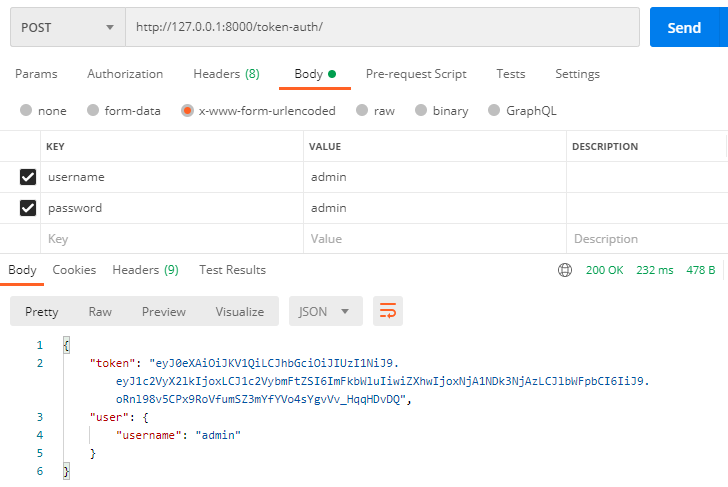
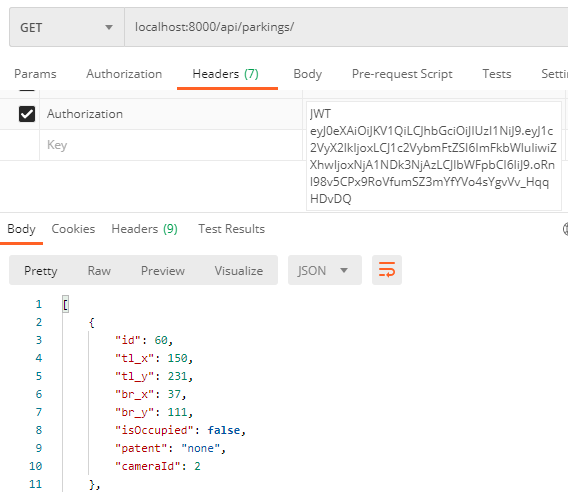

# CRV Smart Parking System API

## Requisitos
* Python 3
* PIP
* Django 2.2.16

## Instalar requisitos
* python -m pip install -U pip setuptools
* python -m pip install Django==2.2.16
* python -m pip install djangorestframework==3.9.1
* python -m pip install django-cors-headers
* python -m pip install djangorestframework-jwt==1.11.0
* python -m pip install pymysql
* python -m pip install django-mysql
* python -m pip install mysqlclient

## Crear base de datos SQLITE
* python manage.py makemigrations (Crea los archivos de migracion necesarios si no estan creados)
* python manage.py migrate (Crea la base y ejecuta los archivos de migracion)
* python manage.py createsuperuser (Crea el super usuario)

### En caso de fallas para correr migraciones por cambio en modelo
* Si nos aparece django.db.utils.OperationalError: table already exists correr por ejemplo python manage.py migrate --fake camaras 0001
* Donde camaras es la appname y 0001 es el archivo de migracion que contiene la creacion de la tabla
* Luego python manage.py migrate camaras 0002

## Exportar base de datos
* 1) python manage.py shell
* 2) from django.contrib.contenttypes.models import ContentType
* 3) ContentType.objects.all().delete()
* 4) exit()
* 5) python manage.py dumpdata --exclude contenttypes > backup_yyyyMMddHHmm.json
* Modificar el archivo .json con Notepad++ y cambiar la codificacion a UTF-8 sin BOM
* Tener en cuenta que el borrado de ContentTypes puede remover los permisos de cada modelo en la API
* Para resolver los permisos que no aparecen, correr python manage.py makemigrations, y volver a asignar los permisos

## Importar base de datos
* Borrar el archivo db.sqlite3
* python manage.py makemigrations
* python manage.py migrate
* python manage.py loaddata backup_yyyyMMddHHmm.json

## Crear tablas en otra base de datos
* python manage.py migrate --database=replica (Donde replica es la base de datos configurada en settings.py - DATABASES

## Credenciales default
* User: admin
* Password: admin

## Iniciar API
* python manage.py runserver (Inicia de manera local debug)
* python manage.py runserver 0.0.0.0:8000 (Inicia el server para ser invocado desde otras url dentro de la misma red, ejemplo un celular)

## Administrar API
* Entrar a http://127.0.0.1:8000/admin para configurar

## Authenticacion JWT
* Entrar a http://127.0.0.1:8000/token-auth/ para obtener los tokens válidos para la autenticación
* Utilizar el token provisto en el header del request. Se deberá utilizar la cabecera "Authorization" y como valor "JWT [token]" donde [token] es el hash provisto por el link anterior.
* Los usuarios son los registrados para acceder al sistema Django.
* 
*  

## Obtener Datos de la API
* Entrar a http://127.0.0.1:8000/api/parkings/ para listar estacionamientos
* Entrar a http://127.0.0.1:8000/api/camaras/ para listar cámaras de seguimiento
* Entrar a http://127.0.0.1:8000/api/camerapatent/ para listar cámaras de patentes
* Entrar a http://127.0.0.1:8000/api/patents/ para listar los tipos de patentes
* Entrar a http://127.0.0.1:8000/api/registrys/ para listar los eventos ocurridos
* Entrar a http://127.0.0.1:8000/api/reports/ para listar las urls de reportes de cubo
* Entrar a http://127.0.0.1:8000/api/top_vehicles/10 para listar el top ten de vehiculos del estacionamiento que mas eventos realizaron (se puede cambiar 10 por el numero deseado)
* Entrar a http://127.0.0.1:8000/api/top_parkings/10 para listar el top ten de lugares del estacionamiento que mas eventos realizaron (se puede cambiar 10 por el numero deseado)
* Entrar a http://localhost:8000/core/current_user para listar los permisos del usuario logueado

## Configurar accesos a los usuarios
* Entrar a http://localhost:8000/admin/auth/group/ para crear / editar grupos y asignar permisos
* Entrar a http://localhost:8000/admin/auth/user/ para crear / editar usuarios y asignar permisos y/o grupos